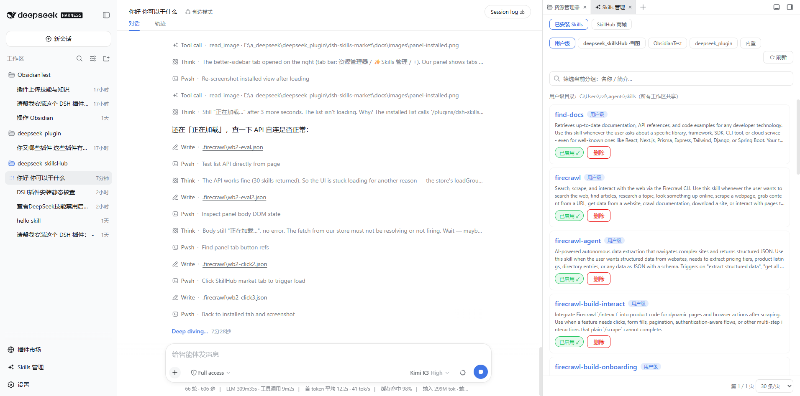
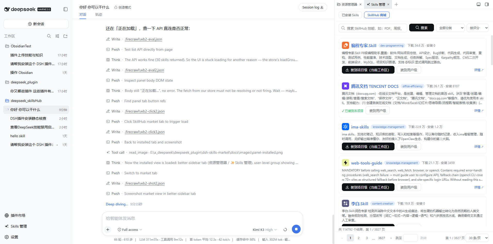

# dsh-skills-market

DSH（DeepSeek Harness）Skills 管理 + SkillHub 商城：在 Web UI 侧边栏入口的浮动面板里管理本地 skills（用户级 / 各工作区项目级 / 内置只读），并直接搜索、安装 [SkillHub](https://www.skillhub.cn/) 上的公开技能。

> 基线版本：`@deepseek-ai/dsh` 0.1.0-rc.6。结构与注册范式参照 `dsh-plugin-market`。

## 功能

- **侧边栏入口 + 浮动面板**：`sidebar.footer.action` 入口按钮（宽栏整行 / 窄栏 36px 圆形图标 + Tooltip，order 负数约定排在 Cordis Plugin 之上），`shell.overlay` 浮动面板，Esc / ✕ / 点击背板关闭，样式全部走 `--dsw-alias-*` 设计令牌（自动明暗主题）
- **适配 dsh-better-sidebar（可选）**：检测到 `ctx.betterSidebar` 服务时，面板以 better-sidebar 原生 tab（`skills-market:manager`，单实例）展示，入口按钮改为定向打开该 tab；未安装时自动回退默认浮窗。声明为 `peerDependencies` + `optional`（不强制安装）
- **已安装管理**：用户级（所有工作区共享）、每个工作区一个页签（打开面板自动定位当前工作区）、内置只读展示；组内筛选（名称/简介）；删除（确认条：提示 + 确认删除/取消）、项目级升用户级；**启停开关**（一键切换 skill 启用/停用——`disable-model-invocation` + `user-invocable` 两个 frontmatter 字段同时控制）；分页（页码窗口 + 跳页 + 10/20/30/50/100 条/页）
- **SkillHub 商城**：手动搜索（按钮 / 回车）、12 个一级分类、评分/下载量/安装量/最新排序、服务端分页；安装状态用**本地清单 join**（VS Code 扩展商城同款），随安装/卸载/换级/刷新与磁盘实时对齐；一键「装到项目级（当前工作区）」或「装到用户级」，同名已存在给出提示
- **模型工具 `dsh_skillhub_search`**：当前会话的 AI 也能直接搜索 SkillHub

## 截图

> 图为 better-sidebar 原生 tab 形态（未安装 better-sidebar 时为同款内容的浮动面板）。

**已安装管理**（better-sidebar 右侧栏 tab：用户级 / 各工作区页签 / 内置只读，启停开关与删除确认条）：



**SkillHub 商城**（手动搜索 + 分类排序 + 安装状态徽章 + 完整分页栏）：



## 架构

```
src/
  index.ts            Host 半：同源 JSON API（webServer 路由）+ 模型工具
  core/skillhub.ts    SkillHub 公开 API（fetch 注入式纯函数，两半共享）
  core/local.ts       本地 skills 目录逻辑（项目根判定 / 扫描 / zip 安装 / 移动 / 删除）
  client/index.tsx    浏览器半入口（locale / styles / slots 注册）
  client/store.ts     面板状态 store（与 React 解耦）
  client/panel.tsx    入口按钮 + 浮动面板组件
```

**Client→Host 通道**：树外插件不能新增 `@Remote` 方法（`packages/api/remotes/README.md` 封闭集），
所以面板数据走 host 半注册的**同源 HTTP 路由** `/plugins/dsh-skills-market/api/*`
（`list` / `search` / `install` / `uninstall` / `set-level`），与官方 hmr 插件同款 `webServer` 用法——
无 CORS、无沙箱限制。

## 安装

```sh
dsh plugin --profile web add dsh-skills-market
# 本地路径：
dsh plugin --profile web add ./dsh-skills-market
# GitHub（建议锁定 commit，防止后续推送悄悄改变运行内容）：
dsh plugin --profile web add github:peiqi10086/dsh-skills-market
dsh plugin --profile web add github:peiqi10086/dsh-skills-market#<sha>
```

本包**提交构建产物 `lib/` 且不带 `prepare` 脚本**，因此从 GitHub 安装不需要 pnpm 的
`allowBuilds` 构建授权——这是[官方发布文档](https://github.com/deepseek-harness/deepseek-harness)
认可的「分发构建产物」方式。安装后**重启** DSH Web（客户端 bundle 表在启动时扫描），
侧边栏底部出现「Skills 管理」入口（插件市场之下、Cordis Plugin 之上）。

## 模型工具 `dsh_skillhub_search`

| 参数 | 类型 | 说明 |
|---|---|---|
| `keyword` | string? | 搜索关键词（分词搜索），留空列出热门 |
| `category` | string? | 一级分类，如 `office-efficiency`、`dev-programming` |
| `sortBy` | string? | `score`（默认）/ `downloads` / `installs` / `newest` |
| `page` | number? | 页码（1 起，每页 10 条） |

## 目录约定（与 dsh skill-filesystem 一致）

- 项目级：`<projectRoot>/.agents/skills`（projectRoot = 从工作区向上找最近的 `.git`）
- 用户级：`<DSH_AGENTS_HOME ?? ~/.agents>/skills`
- 内置 / `.dsh` / 运行时来源的 skills 只读展示，不提供操作入口

## 开发

```sh
pnpm install
pnpm build       # tsdown：lib/index.js（Host ESM）+ lib/client.js（浏览器 CJS 工厂包装）
pnpm test        # node:test（零测试框架依赖）：SkillHub 映射 / frontmatter 解析 / zip 安装（含穿越防护）/ 移动删除
pnpm typecheck   # tsc --noEmit（strict）
```

零 `@deepseek-ai/*` 运行时依赖（避免 cordis 双实例）；平台模块（react、ui-primitives）由
DSH 加载器模块表在运行时应答；zip 解压用内联打包的 fflate。测试使用 Node 内置
`node:test`（type stripping 直跑 .ts），使 git 安装的依赖图不含任何构建脚本（无 esbuild）。

## License

MIT — see [LICENSE](./LICENSE).
